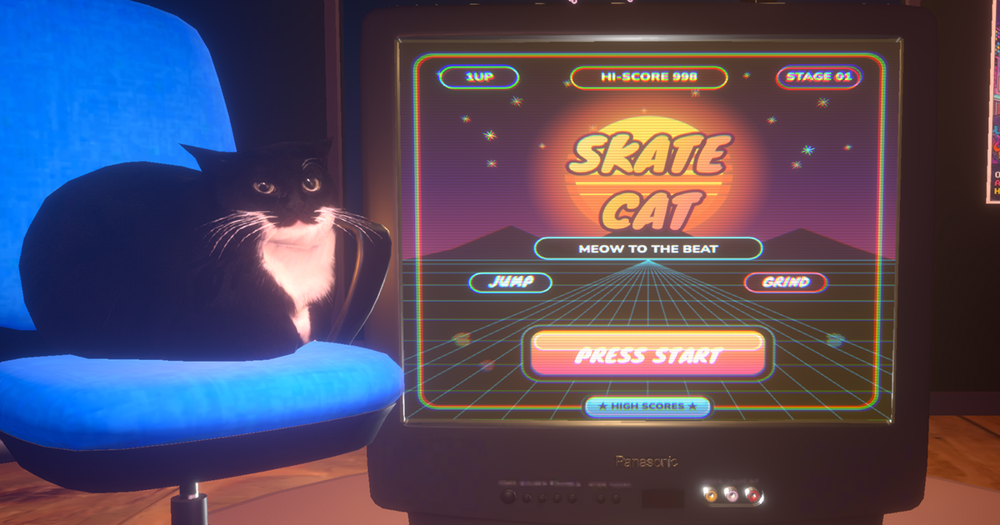

<div align="center">

# 🛹 Skate Cat

**A 3D skateboarding cat rhythm game. Jump logs, grind rails, land tricks to the beat.**

<a href="https://skate-cat-meow.vercel.app/">
  
</a>

[](https://skate-cat-meow.vercel.app/)
[](LICENSE)

[](https://react.dev)
[](https://threejs.org)
[](https://r3f.docs.pmnd.rs)
[](https://vite.dev)
[](https://skate-cat-meow.vercel.app/)

</div>

---

## What it is

Skate Cat is a single-session, browser-based rhythm game wrapped around a lovable cat on a skateboard. You:

- 🎬 Boot into a **CRT-era living room** with a playable start screen
- 🎵 Drop into a neon skate course where **logs, rails, and pickups are synced to the music**
- 🏆 Chase the top of a **global leaderboard** powered by Supabase

Everything runs in the browser — WebGL, Web Audio, no plugins, no installs.

## Highlights

- **Custom toon-shader pipeline** — stepped NdotL lighting, rim highlights, and eye-blink UV masking (`src/shaders/`)
- **60fps game loop with mutable refs** — bypasses React state for frame-critical updates (`src/store.js`)
- **Beat-perfect scoring** — offline `librosa` pass produces a per-song analysis sidecar consumed at runtime (`scripts/analyze_track.py`)
- **Mobile-friendly Web Audio** — unlocks the iOS `AudioContext` on the first tap so music + SFX actually play (`src/audioTransport.js`, `src/sfxPlayer.js`)
- **Global leaderboard via Vercel Serverless Functions** — browser never touches Supabase directly; a service-role key stays server-side (`api/`, `supabase/`)
- **Post-processing transitions** — a circular reveal blends the intro scene into gameplay (`src/components/TransitionEffect.jsx`, `PostEffects.jsx`)

## Quickstart

```bash
git clone https://github.com/MatthewGreenberg/skate-cat.git
cd skate-cat
npm install
npm run dev
```

Open http://localhost:5173. That's it — the game plays fully offline.

### Want the leaderboard working locally?

1. Create a Supabase project and run [`supabase/leaderboard.sql`](supabase/leaderboard.sql)
2. Copy [`.env.example`](.env.example) to `.env` and fill in your credentials
3. Use `vercel dev` instead of `npm run dev` so the `/api/*` serverless routes are served alongside Vite

## Tech stack

| Layer | Tech |
|---|---|
| Rendering | Three.js, [@react-three/fiber](https://r3f.docs.pmnd.rs), [@react-three/drei](https://github.com/pmndrs/drei), [@react-three/postprocessing](https://github.com/pmndrs/postprocessing) |
| App | React 19, Vite 7, SWC |
| Audio | Web Audio API + offline `librosa` beat analysis |
| Backend | Vercel Serverless Functions + Supabase (Postgres) |
| Dev tooling | Leva (live param tuning), ESLint flat config |

## Project layout

```
api/            Vercel serverless functions (leaderboard read/write)
supabase/       SQL schema for the leaderboard table
scripts/        Offline librosa beat analyzer
src/
  shaders/      GLSL toon/outline/log shaders
  lib/          Pure logic modules (obstacle patterns, materials, track analysis)
  hooks/        Custom React hooks
  components/   React + R3F scenes, models, effects, HUD
    intro/      CRT living-room intro scene
public/
  models/       GLB/GLTF assets (cat, obstacles, intro props)
  textures/     Wood, posters, etc.
  audio/        Songs + generated beat-analysis JSON
  basis/        KTX2 transcoder WASM
```

## Beat analysis

Pre-compute per-song beat / bar / phrase metadata with [`scripts/analyze_track.py`](scripts/analyze_track.py):

```bash
python3 -m pip install -r scripts/requirements-librosa.txt
python3 scripts/analyze_track.py \
  public/audio/music/skate-cat-2.mp3 \
  public/audio/music/skate-cat-2.analysis.json \
  --audio-public-path /audio/music/skate-cat-2.mp3 \
  --bpm 170 --phase-offset-seconds -0.068
```

Schema and runtime integration: [`docs/audio-analysis-schema.md`](docs/audio-analysis-schema.md).

## Credits

Third-party 3D assets retain their original licenses. See the `license.txt` alongside each model in `public/models/`:

- [Maxwell the cat](public/models/cat/license.txt) by sugarcatcat (CC BY 4.0)
- [Tree log](public/models/obstacles/large_tree_log/license.txt) (CC BY 4.0)

## License

MIT — see [LICENSE](LICENSE).
